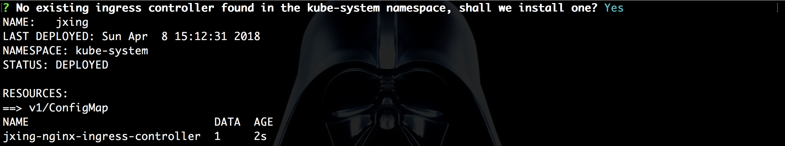

# Jenkins X: Nova solução de CI/CD para Kubernetes - Parte 2

Olá pessoal, vamos continuar explorando a plataforma, agora colocando a mão na massa, caso não tenha lido, recomendo conferir a primeira parte ([Jenkins X: Nova solução de CI/CD para Kubernetes - Parte 1](#)).

Tudo pronto, vamos conferir ?

## Pré-requisitos

* **jx** - http://jenkins-x.io/getting-started/install
* **kubectl** - https://kubernetes.io/docs/tasks/tools/install-kubectl

Neste caso utilizei um cluster Kubernetes na Amazon, logo será necessário instalar e configurar o kops:

* **kops** - https://kubernetes.io/docs/getting-started-guides/kops

Mesmo se optar o por outro cloud provider (Google ou Azure), os passos em diante serão iguais.

## Instalando o Jenkins X

Existe 2 formas de instalarmos o Jenkins X, sendo:

* Criando um novo cluster Kubernetes + Jenkins X:
* Instalando o Jenkins X em um cluster Kubernetes existente:

Neste POST vou seguir instalando um Jenkins X em um novo cluster Kubernetes na AWS:

```
jx create cluster aws \
--cluster-name="jx" \
--default-environments=false \
--zones us-east-1a,us-east-1b,us-east-1c \
--nodes=3
```

Sobre as opções:

* **aws**: É nosso cloud provider
* **cluster-name**: Nome que podemos definir
* **default-environments**: Desabilitando a criação de ambiente de exemplo, para tornar o post mais dinâmico e para explicarmos melhor o passo-a-passo.
* **zones**: Indicar as zonas de disponibilidade para os nodes.
* **nodes**: Quantidade de nodes que terá o cluster.

E podemos definir ainda mais opções de instalação que varia de acordo com o cloud provider, se tiver dúvidas não hesite em usar _"jx create cluster aws --help"_

Vamos executar e acompanhar o que está sendo realizado:

* Neste momento o cluster estará sendo provisionado na AWS e expor as informações criadas (Ex: nodes, services e etc):


* Como se trata de um novo cluster, será necessário um "ingress controller (nginx)" que será associado, neste caso, á um AWS ELB (Elastic Load Balancer) para rotear o tráfego externo ao cluster Kubernetes:



* Depois use a opção para a resolução do endereço do ELB para IP, isso é necessário, pois não estamos usando um domínio próprio, e vamos usar um subdomínio "*.nip.io (dns público), no item "domain" apenas prossiga (enter):


* Agora precisamos definir uma conta do **GitHub** com _Personal Token_ para que o Jenkins X possa utilizar para a criação de repositórios de ambiente para que possa ser colocado em prática o GitOps:


* Se tudo deu certo, será exibido esta mensagem, com a senha inicial de acesso:


* Depois rode este comando para obter os endpoints dos recursos criados (Jenkins, Nexus, Monocular e etc):


* E acessar o Jenkins:


## Importando nosso primeiro projeto

Agora vamos começar a trabalhar com o Jenkins X, neste caso vamos importar um projeto existente, que utiliza uma das linguagens que há suporte, conforme explicado na primeira parte deste post.

Neste exemplo, realizei um _fork_ da projeto exemplo o [spring-petclinic](https://github.com/spring-projects/spring-petclinic), para o meu repositório no GitHub.

* Após o _fork_ realizei o _clone_ local:

```
git clone https://github.com/alexbaptista/spring-petclinic.git
```

* Importando o projeto:

```
cd sprint-petclinic
jx import
```

* Como se trata do nosso primeiro projeto, é necessário configurar uma única vez a "API Token do Jenkins" para o **jx**:


Agora vamos ver o que foi gerado nestas ações.

* Como explicado no primeiro post, foi criado o **DRAFT_PACK** contendo Dockerfile, Jenkinsfile e template helmchart para o deploy no Kubernetes, de acordo com a tecnologia existente (neste caso o spring), e estas informações são _commitadas_ no Git:


> Obs: No Draft pack é criado também um template de Health Check do app (spring-petclinic) para o Kubernetes
os valores estão em "charts/spring-petclinic/values.yaml", no parâmetro _probePath_ está configurado para um Path que não existe no app
customizei apontando para "/" para não ter erro após o deploy (503 Service Temporarily Unavailable)

> Obs 2: Com este repositório, este Jenkins já possui acesso como "colaborador", pode ser que com o seu repositório seja necessário conceder acesso ao usuário GitHub definido no processo de instalação do Jenkins.

* Na sequencia é exibido algumas informações, como a URL da pipeline criada, e o Webhook automaticamente configurado:


Ao conferir no Jenkins, há o job criado com a pipeline "default" para apps Spring, que realiza os steps:

- **Build** - _mvn install_ arquiva o artefato no Nexus (use _jx open_ para obter a URL)


- **Release** - _Release e TAG no GitHub_


- **Promotion to Environments**

Ocorrerá uma falha neste step pois ainda não temos ambientes criados, iremos abordar na sequência.

## Criando nossos ambientes

Legal, já temos um cluster, Jenkins, e uma aplicação, agora precisamos criar ambientes (namespaces no Kubernetes) para que possamos seguir com o CI/CD.

```
jx create env
```

* Criamos um ambiente "DEV" com flag para deploy "Automático":


* Foi criado uma repo para o ambiente no Github:


Criamos mais ambientes como "HOMOLOG" e "PRODUCTION", mas nestes ambientes a flag será "Manual"

* Relação dos ambientes que temos atualmente:

```
jx get envs
```


## CI & CD com GitOps

### CI

Bom, já temos os ambientes criados, vamos re-executar novamente o JOB do petclinic no Jenkins, o erro no step de "Promotion to Environments" não deve ocorrer mais, pois temos o ambiente "petclinic-dev" para deploy "Automático"

* Podemos fazer isso com a command-line

```
jx start pipeline alexbaptista/spring-petclinic/master
```

* Acompanhando os logs

```
jx get build logs alexbaptista/spring-petclinic/master
```

* Chegamos ao step de promoção, é aberto um PULL REQUEST no repositório do ambiente (petclinic-dev)

ex: https://github.com/****/environment-jx-petclinic-dev/pull/1


* Neste _PULL REQUEST_ é acionado um JOB de acordo com o número do PR via Webhook, no qual executa o CHECK por meio de uma pipeline (Jenkinsfile), neste momento a única validação é se a versão promovida (ex: 0.0.1) é válida, mas é possível adicionar mais steps nesta pipeline, para ao mesmo tempo automatizar o processo, e adicionar garantias de qualidade (Ex: Testes de sanidade, aceitação e etc) e validação do Deploy


* Com o check e deploy validado, o merge é realizado automaticamente, finalizando com sucesso o Pull Request


* Por default, o build (spring-petclinic) aguarda a validação do Pull Request, e finaliza o step de acordo com o resultado do job de check do Pull request


> Isto pode ser modificado (aguardar ou não o Pull request), mas como neste exemplo a pipeline apenas promove para ambientes que possuem a flag "Auto", no caso Dev, é ideal manter neste formato.

* Visualizando as aplicações por ambiente

```
jx get apps -e petclinic-dev
```


Agora basta acessar o app pela URL

Vamos então promover esta aplicação para os demais ambientes que criamos (Homolog e Production)

* Para promoção para outros ambientes, usamos o comando:

```
jx promote -a spring-petclinic -v 0.0.3 -e petclinic-homolog
```

* O processo é o mesmo que em Dev (aberto o Pull request > check > Deploy), a diferença neste exemplo, é que estamos utilizando o comando para a promoção, mas nada que não possa ser automatizado, aliado com o fluxo de "check" do Pull request, como explicado acima


* Para o ambiente seguinte, basta seguir o mesmo fluxo, mas modificando o ambiente:

```
jx promote -a spring-petclinic -v 0.0.3 -e petclinic-production
```

* Overview do que de aplicações no ambiente


## Ambiente "Preview"

Como detalhado no primeiro post, trata-se de um ambiente criado sob-demanda quando há "Pull Request" aberto para o repositório da plicação.

* Criei uma branch no spring-petclinic com algumas edições:

```
cd spring-petclinic
git checkout -b feature/teste
git push --set-upstream origin feature/teste
```

* Criei um pull request no GitHub:


* É criado o JOB de acordo do número do Pull Request:


> Obs: Caso o job não seja criado automaticamente, verifique nas configurações em _Branch Sources > Github > Filter by name (with regular expression)_ se o campo "Regular expression" está como '.*', se não estiver, ajuste e salve o job

* Note, que foi criado um ambiente adicional, para este pull request:


Ainda não há um commando no JX para obter a URL criada no preview, inclusive há uma issue em andamento 

https://github.com/jenkins-x/jx/issues/389

A alternativa neste momento é utilizar o kubectl para obter a URL

```
kubectl get services --namespace jx-alexbaptista-spring-petclinic-pr-1 -o yaml | grep fabric8.io/exposeUrl
```

## Conclusão

Realizei algumas observações durante o post de possíveis problemas, como se trata da primeira release do projeto, é natural ter pequenos bugs.

Bem é isso pessoal, espero que tenham gostado e até a próxima !