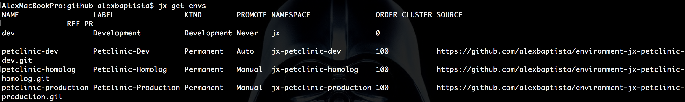
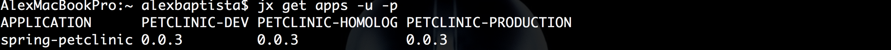

<div style="text-align:center"></div>

# Jenkins X: Nova solução de CI/CD para Kubernetes - Parte 2

Ontem começamos aqui no Blog uma série sobre o Jenkins X, uma nova solução de CI/CD desenvolvida pela CloudBees. Se você perdeu, clique aqui para ver a introdução. Hoje vamos continuar explorando a plataforma, agora colocando a mão na massa. Vamos lá?

## Pré-requisitos

* **jx** - http://jenkins-x.io/getting-started/install
* **kubectl** - https://kubernetes.io/docs/tasks/tools/install-kubectl

Neste caso, como utilizei um cluster Kubernetes na Amazon, é preciso instalar e configurar o kops:

* **kops** - https://kubernetes.io/docs/getting-started-guides/kops

Mesmo se optar o por outro cloud provider (Google ou Azure), os próximos passos serão os mesmos.

## Instalando o Jenkins X

São duas as formas de instalar o Jenkins X:

* Criando um novo cluster Kubernetes + Jenkins X;
* Instalando o Jenkins X em um cluster Kubernetes existente.

Neste post vou instalar o Jenkins X em um novo cluster Kubernetes na AWS:

```
jx create cluster aws \
--cluster-name="jx" \
--default-environments=false \
--zones us-east-1a,us-east-1b,us-east-1c \
--nodes=3
```

Sobre as opções:

* **aws**: é nosso cloud provider;
* **cluster-name**: nome que podemos definir;
* **default-environments**: desabilita a criação de ambiente de exemplo, para tornar o post mais dinâmico e para explicarmos melhor o passo a passo;
* **zones**: indica as zonas de disponibilidade para os nodes;
* **nodes**: quantidade de nodes que terá o cluster.

Podemos definir ainda mais opções de instalação, que variam de acordo com o cloud provider. Se tiver dúvidas é só usar _"jx create cluster aws --help"_

Vamos executar e acompanhar o que está acontecendo:

* Neste momento o cluster está sendo provisionado na AWS e expondo as informações criadas (Ex: nodes, services e etc):


* Como se trata de um novo cluster, é preciso ter um "ingress controller (nginx)" que será associado, neste caso, a um AWS ELB (Elastic Load Balancer) para rotear o tráfego externo ao cluster Kubernetes:


* Use a opção para a resolução do endereço do ELB para IP. Isso é necessário pois não estamos usando um domínio próprio, vamos usar um subdomínio "*.nip.io (dns público)". No item "domain" apenas prossiga (enter):


* Agora precisamos definir uma conta do **GitHub** com _Personal Token_ para que o Jenkins X utilize para a criação de repositórios de ambiente, colocando em prática o GitOps:


* Se tudo deu certo vai aparecer esta mensagem, com a senha inicial de acesso:


* Depois, rode este comando para obter os endpoints dos recursos criados (Jenkins, Nexus, Monocular e etc):


* E acessar o Jenkins:


## Importando nosso primeiro projeto

Agora vamos começar a trabalhar com o Jenkins X! Como exemplo vamos importar um projeto existente que utiliza uma das linguagens para as quais há suporte, conforme explicado na primeira parte desta série.

Neste exemplo fiz um _fork_ do projeto exemplo, o [spring-petclinic](https://github.com/spring-projects/spring-petclinic), para o meu repositório no GitHub.

* Após o _fork_ realizei o _clone_ local:

```
git clone https://github.com/alexbaptista/spring-petclinic.git
```

* Importando o projeto:

```
cd sprint-petclinic
jx import
```

* Como é o nosso primeiro projeto, é necessário configurar uma única vez a "API Token do Jenkins" para o **jx**:


Agora vamos ver o que foi gerado:

* Como explicado no primeiro post, criamos o **DRAFT_PACK** com Dockerfile, Jenkinsfile e template helmchart para o deploy no Kubernetes, de acordo com a tecnologia existente (neste caso o spring), e essas informações foram _commitadas_ no Git:


> Obs: No Draft Pack também tem um template de Health Check do app (spring-petclinic) para o Kubernetes. Os valores estão em "charts/spring-petclinic/values.yaml". O parâmetro _probePath_ está configurado para um Path que não existe no app, eu
customizei apontando para "/" para não ter erro após o deploy (503 Service Temporarily Unavailable).

> Obs 2: Com este repositório o Jenkins já possui acesso como "colaborador", pode ser que com o seu repositório seja necessário conceder acesso ao usuário GitHub definido no processo de instalação do Jenkins.

* Na sequência, algumas informações, como a URL da pipeline criada, são exibidas, e o Webhook é configurado automaticamente:


Se você for conferir o Jenkins, vai ver o job criado com a pipeline "default" para apps Spring, que segue os seguintes passos:

- **Build** - _mvn install_ arquiva o artefato no Nexus (use _jx open_ para obter a URL)


- **Release** - _Release e TAG no GitHub_


- **Promotion to Environments**

Neste step vai aparecer falha, pois ainda não temos ambientes criados. A gente já chega lá.

## Criando nossos ambientes

Legal, já temos um cluster, Jenkins, e uma aplicação. Agora precisamos criar ambientes (namespaces no Kubernetes) para que possamos seguir com o CI/CD.

```
jx create env
```

* Criamos um ambiente "DEV" com flag para deploy "Automático":


* Criamos uma repo para o ambiente no Github:


* Criamos mais ambientes como "HOMOLOG" e "PRODUCTION", mas neles a flag será "Manual".

* Relação dos ambientes que temos atualmente:

```
jx get envs
```


## CI & CD com GitOps

### CI

Bom, com os ambientes criados vamos executar novamente o JOB do petclinic no Jenkins. Aí o erro no step de "Promotion to Environments" não deve ocorrer mais, pois temos o ambiente "petclinic-dev" para deploy "Automático".

* Podemos fazer isso com a command-line:

```
jx start pipeline alexbaptista/spring-petclinic/master
```

* Acompanhando os logs:

```
jx get build logs alexbaptista/spring-petclinic/master
```

* Chegamos ao step de promoção. Aqui, abrimos um PULL REQUEST no repositório do ambiente (petclinic-dev).

ex: https://github.com/****/environment-jx-petclinic-dev/pull/1


* Neste _PULL REQUEST_ acionamos um JOB de acordo com o número do PR via Webhook. Nele, executamos o CHECK por meio de uma pipeline (Jenkinsfile), e neste momento a única validação é se a versão promovida (ex: 0.0.1) é válida. Entretanto, ainda é possível adicionar mais steps nesta pipeline, para automatizar o processo e adicionar garantias de qualidade ao mesmo tempo (Ex: Testes de sanidade, aceitação e etc) e validação do Deploy.


* Com o check e deploy validados, o merge é realizado automaticamente e finalizamos com sucesso o Pull Request:


* Por default, o build (spring-petclinic) aguarda a validação do Pull Request e finaliza o step de acordo com o resultado do job de check.


> Isso pode ser modificado (aguardar ou não o Pull request), mas como neste exemplo a pipeline apenas promove para ambientes que possuem a flag "Auto", no caso Dev, é ideal manter neste formato.

* Visualizando as aplicações por ambiente:

```
jx get apps -e petclinic-dev
```


Agora basta acessar o app pela URL.

* Vamos, então, promover esta aplicação para os demais ambientes que criamos (Homolog e Production), usando o comando:

```
jx promote -a spring-petclinic -v 0.0.3 -e petclinic-homolog
```

* O processo é o mesmo que em Dev (aberto o Pull request > check > Deploy), a diferença neste exemplo é que estamos utilizando o comando para a promoção, mas nada que não possa ser automatizado, aliado ao fluxo de "check" do Pull request, como explicado acima.


* Para o ambiente seguinte, basta seguir o mesmo fluxo modificando o ambiente:

```
jx promote -a spring-petclinic -v 0.0.3 -e petclinic-production
```

* Overview de aplicações no ambiente



## Ambiente "Preview"

É um ambiente criado sob demanda quando há "Pull Request" aberto para o repositório da aplicação.

* Criei uma branch no spring-petclinic com algumas edições:

```
cd spring-petclinic
git checkout -b feature/teste
git push --set-upstream origin feature/teste
```

* Criei um pull request no GitHub:


* O JOB é criado automaticamente de acordo do número do Pull Request:


> Obs: Caso o job não seja criado automaticamente, verifique nas configurações em _Branch Sources > Github > Filter by name (with regular expression)_ se o campo "Regular expression" está como '.*'. Se não estiver, ajuste e salve o job.

* Note que um ambiente adicional também foi criado para este pull request:


Ainda não há um commando no JX para obter a URL criada no preview, inclusive há uma issue em andamento.

https://github.com/jenkins-x/jx/issues/389

A alternativa neste momento é utilizar o kubectl para obter a URL

```
kubectl get services --namespace jx-alexbaptista-spring-petclinic-pr-1 -o yaml | grep fabric8.io/exposeUrl
```

## Conclusão

Como é a primeira release do projeto, é natural que aconteçam pequenos bugs. Tentei passar algumas observações durante o post, mas se vcoê ainda tem dúvidas ou tem algo pra compartilhar com a gente, é só deixar abaixo nos comentários, ok? Espero que tenham gostado e até a próxima!
